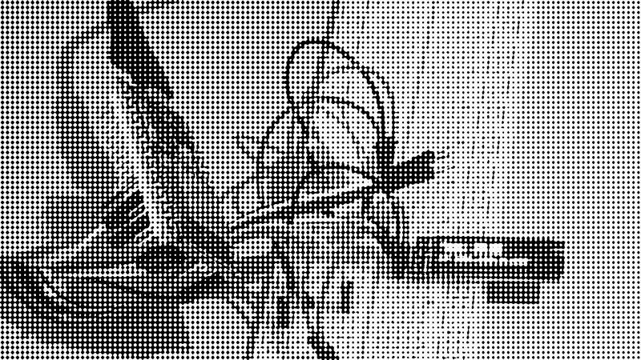

Exploring dithering: batch convert images (image magic)

# Creative Coding / Visual Experiments
## an ongoing coding/research seminar
<http://creativecoding.xyz>

## Exploring dithering


This is a very quick script to batch generate images conversion via image magic.
It's using an array and a loop to generate commands on cli, which exectued conver the headre.jpeg file; each iteration of the code also concatenate a bit of html (< img > and some container). Once the loop is over, the html string is saved into a text file.
It was not practical to experiment with the command line and I needed to get an overview of the differences amongst the different files; I also needed to preview how the image would work with some basic css layering (hence the multiple containers).

Usage:
```php batch_convert.php```
if the only image file in the folder is the `header.jpeg` then it will create all the versions based on the dithering parameters in the array.

Inspired by <https://solar.lowtechmagazine.com/2018/09/how-to-build-a-lowtech-website.html>, and the front-end details <https://github.com/lowtechmag/solar/wiki/Solar-Web-Design>
More: <https://homebrewserver.club/low-tech-website-howto.html#image-compression>
Based on <https://legacy.imagemagick.org/Usage/bugs/ordered-dither/>

Requirements
- Image Magic
- PHP