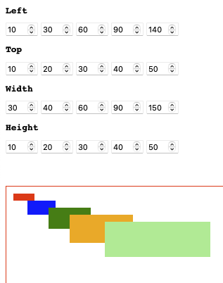

Interface to control css values

# Creative Coding / Visual Experiments
## an ongoing coding/research seminar
<http://creativecoding.xyz>

## Interface to control css values

While working on the animation for the creative_coding_55, I wanted to have a simple set of boxes to adapt parameters live on the screen to fine tune animation timing, delay, values etc.

This experiment draws on addressing the dom element and its parameters via classes and attributes, that are parsed

